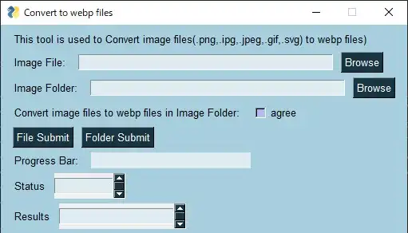

# convert_img_fmt_to_webp-GUI-
## Summary

convert image files(format: png,ipg,jpeg,gif,svg) to webp file on operating GUI.

## GUI Image

## Note
[Info] You must install "PySimpleGUI" and pillow by pip, if not.

## References
・About PySimpleGUI: https://github.com/PySimpleGUI/PySimpleGUI

・About Pillow: https://pypi.org/project/Pillow/
